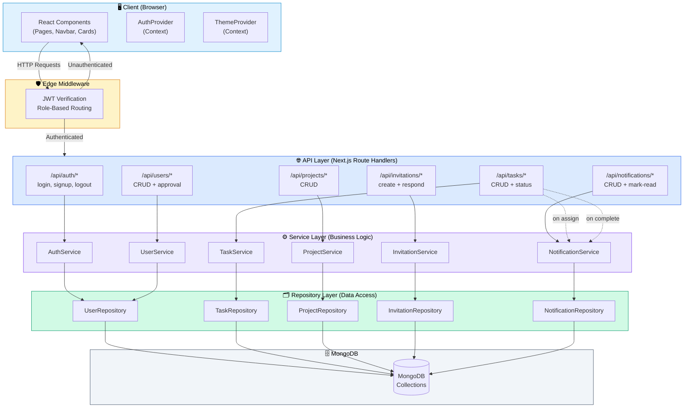

# Architecture Diagram

```mermaid
graph TB
    subgraph Client["🖥️ Client (Browser)"]
        UI["React Components<br/>(Pages, Navbar, Cards)"]
        AP["AuthProvider<br/>(Context)"]
        TP["ThemeProvider<br/>(Context)"]
    end

    subgraph Middleware["🛡️ Edge Middleware"]
        MW["JWT Verification<br/>Role-Based Routing"]
    end

    subgraph API["🌐 API Layer (Next.js Route Handlers)"]
        AUTH_API["/api/auth/*<br/>login, signup, logout"]
        TASK_API["/api/tasks/*<br/>CRUD + status"]
        USER_API["/api/users/*<br/>CRUD + approval"]
        PROJECT_API["/api/projects/*<br/>CRUD"]
        INVITE_API["/api/invitations/*<br/>create + respond"]
        NOTIF_API["/api/notifications/*<br/>CRUD + mark-read"]
    end

    subgraph Services["⚙️ Service Layer (Business Logic)"]
        AS["AuthService"]
        US["UserService"]
        TS["TaskService"]
        PS["ProjectService"]
        IS["InvitationService"]
        NS["NotificationService"]
    end

    subgraph Repositories["🗂️ Repository Layer (Data Access)"]
        UR["UserRepository"]
        TR["TaskRepository"]
        PR["ProjectRepository"]
        IR["InvitationRepository"]
        NR["NotificationRepository"]
    end

    subgraph Database["🗄️ MongoDB"]
        DB[(MongoDB<br/>Collections)]
    end

    UI -->|HTTP Requests| MW
    MW -->|Authenticated| API
    MW -->|Unauthenticated| UI

    AUTH_API --> AS
    TASK_API --> TS
    USER_API --> US
    PROJECT_API --> PS
    INVITE_API --> IS
    NOTIF_API --> NS

    AS --> UR
    US --> UR
    TS --> TR
    PS --> PR
    IS --> IR
    NS --> NR

    UR --> DB
    TR --> DB
    PR --> DB
    IR --> DB
    NR --> DB

    TASK_API -.->|on assign| NS
    TASK_API -.->|on complete| NS

    style Client fill:#e0f2fe,stroke:#0284c7,color:#000
    style Middleware fill:#fef3c7,stroke:#d97706,color:#000
    style API fill:#dbeafe,stroke:#2563eb,color:#000
    style Services fill:#ede9fe,stroke:#7c3aed,color:#000
    style Repositories fill:#d1fae5,stroke:#059669,color:#000
    style Database fill:#f1f5f9,stroke:#475569,color:#000
```
