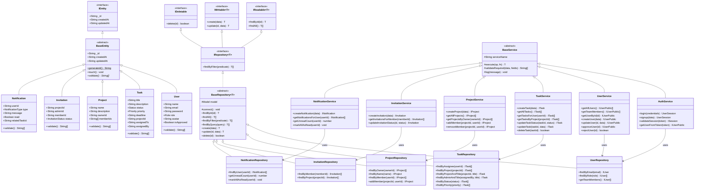

# Class Diagram

```mermaid
classDiagram
    %% ─── Interfaces ───
    class IEntity {
        <<interface>>
        +String _id
        +String createdAt
        +String updatedAt
    }

    class IReadable~T~ {
        <<interface>>
        +findById(id) T
        +findAll() T[]
    }

    class IWritable~T~ {
        <<interface>>
        +create(data) T
        +update(id, data) T
    }

    class IDeletable {
        <<interface>>
        +delete(id) boolean
    }

    class IRepository~T~ {
        <<interface>>
        +findByFilter(predicate) T[]
    }

    IReadable <|-- IRepository
    IWritable <|-- IRepository
    IDeletable <|-- IRepository

    %% ─── Abstract Base Classes ───
    class BaseEntity {
        <<abstract>>
        +String _id
        +String createdAt
        +String updatedAt
        +generateId()$ String
        +touch() void
        +validate()* String[]
    }

    class BaseRepository~T~ {
        <<abstract>>
        #Model model
        #connect() void
        +findById(id) T
        +findAll() T[]
        +findByFilter(predicate) T[]
        +findByQuery(query) T[]
        +create(data) T
        +update(id, data) T
        +delete(id) boolean
    }

    class BaseService {
        <<abstract>>
        #String serviceName
        #execute(op, fn) T
        #validateRequired(data, fields) String[]
        #log(message) void
    }

    IEntity <|.. BaseEntity
    IRepository <|.. BaseRepository

    %% ─── Entity Models ───
    class User {
        +String name
        +String email
        +String password
        +Role role
        +String avatar
        +Boolean isApproved
        +validate() String[]
    }

    class Task {
        +String title
        +String description
        +Status status
        +Priority priority
        +String deadline
        +String projectId
        +String assignedTo
        +String assignedBy
        +validate() String[]
    }

    class Project {
        +String name
        +String description
        +String ownerId
        +String[] memberIds
        +validate() String[]
    }

    class Invitation {
        +String projectId
        +String adminId
        +String memberId
        +InvitationStatus status
        +validate() String[]
    }

    class Notification {
        +String userId
        +NotificationType type
        +String message
        +Boolean read
        +String relatedTaskId
        +validate() String[]
    }

    BaseEntity <|-- User
    BaseEntity <|-- Task
    BaseEntity <|-- Project
    BaseEntity <|-- Invitation
    BaseEntity <|-- Notification

    %% ─── Repositories ───
    class UserRepository {
        +findByEmail(email) IUser
        +findByRole(role) IUser[]
        +getTeamMembers() IUser[]
    }

    class TaskRepository {
        +findByAssignee(userId) ITask[]
        +findByProject(projectId) ITask[]
        +findByProjectAndTitle(projectId, title) ITask
        +findByAdminAndTitle(assignedBy, title) ITask
        +findByStatus(status) ITask[]
        +findByPriority(priority) ITask[]
    }

    class ProjectRepository {
        +findByOwner(ownerId) IProject[]
        +findByName(name) IProject
        +findByMember(userId) IProject[]
        +addMember(projectId, userId) IProject
    }

    class InvitationRepository {
        +findByMember(memberId) IInvitation[]
        +findByProject(projectId) IInvitation[]
    }

    class NotificationRepository {
        +findByUser(userId) INotification[]
        +getUnreadCount(userId) number
        +markAllAsRead(userId) void
    }

    BaseRepository <|-- UserRepository
    BaseRepository <|-- TaskRepository
    BaseRepository <|-- ProjectRepository
    BaseRepository <|-- InvitationRepository
    BaseRepository <|-- NotificationRepository

    %% ─── Services ───
    class AuthService {
        +login(credentials) UserSession
        +signup(data) UserSession
        +validateSession(token) ISession
        +getUserFromToken(token) IUserPublic
    }

    class UserService {
        +getAllUsers() IUserPublic[]
        +getTeamMembers() IUserPublic[]
        +getUserById(id) IUserPublic
        +createUser(data) IUserPublic
        +updateUser(id, data) IUserPublic
        +approveUser(id) IUserPublic
        +rejectUser(id) boolean
    }

    class TaskService {
        +createTask(data) ITask
        +getAllTasks() ITask[]
        +getTasksForUser(userId) ITask[]
        +getTasksByProject(projectId) ITask[]
        +updateTaskStatus(taskId, status) ITask
        +updateTask(taskId, data) ITask
        +deleteTask(taskId) boolean
    }

    class ProjectService {
        +createProject(data) IProject
        +getAllProjects() IProject[]
        +getProjectsByOwner(ownerId) IProject[]
        +addMember(projectId, userId) IProject
        +removeMember(projectId, userId) IProject
    }

    class InvitationService {
        +createInvitation(data) IInvitation
        +getInvitationsForMember(memberId) IInvitation[]
        +updateInvitationStatus(id, status) IInvitation
    }

    class NotificationService {
        +createNotification(data) INotification
        +getNotificationsForUser(userId) INotification[]
        +getUnreadCount(userId) number
        +markAllAsRead(userId) void
    }

    BaseService <|-- AuthService
    BaseService <|-- UserService
    BaseService <|-- TaskService
    BaseService <|-- ProjectService
    BaseService <|-- InvitationService
    BaseService <|-- NotificationService

    %% ─── Dependencies ───
    AuthService --> UserRepository : uses
    UserService --> UserRepository : uses
    TaskService --> TaskRepository : uses
    ProjectService --> ProjectRepository : uses
    InvitationService --> InvitationRepository : uses
    NotificationService --> NotificationRepository : uses
```
