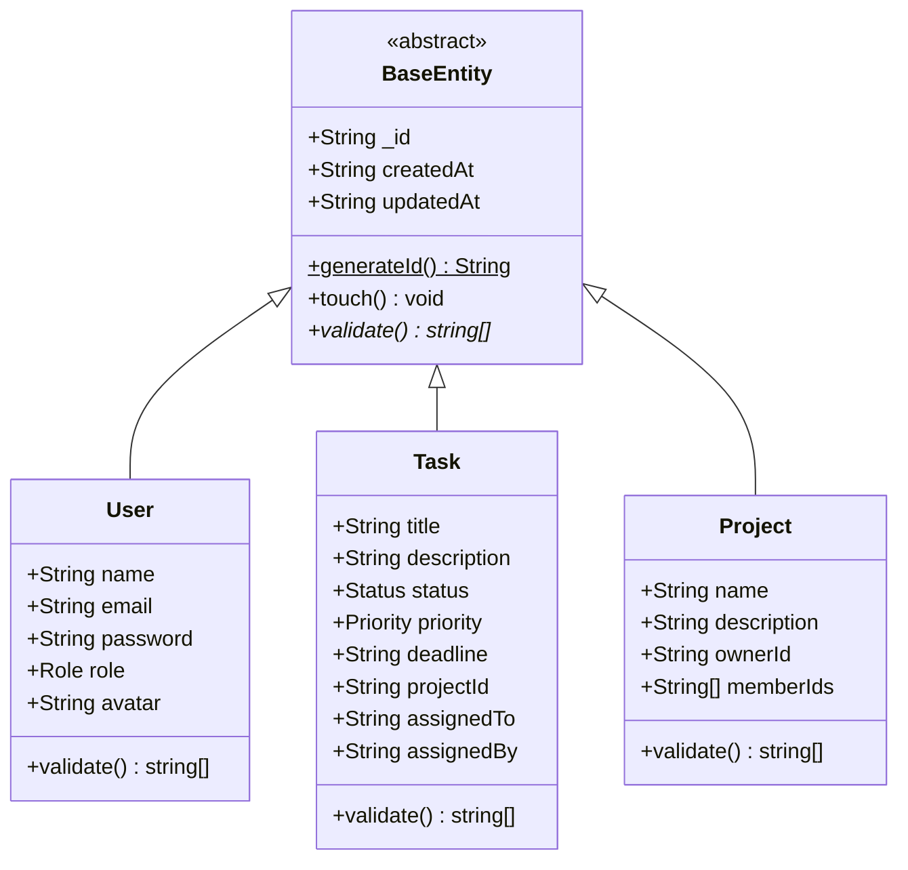

# Class Diagram

```mermaid
classDiagram
    class BaseEntity {
        <<abstract>>
        +String _id
        +String createdAt
        +String updatedAt
        +generateId() String$
        +touch() void
        +validate()* string[]
    }

    class User {
        +String name
        +String email
        +String password
        +Role role
        +String avatar
        +validate() string[]
    }

    class Task {
        +String title
        +String description
        +Status status
        +Priority priority
        +String deadline
        +String projectId
        +String assignedTo
        +String assignedBy
        +validate() string[]
    }

    class Project {
        +String name
        +String description
        +String ownerId
        +String[] memberIds
        +validate() string[]
    }

    BaseEntity <|-- User
    BaseEntity <|-- Task
    BaseEntity <|-- Project
```
