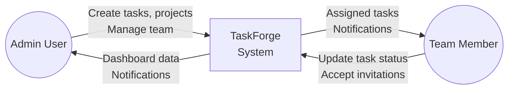
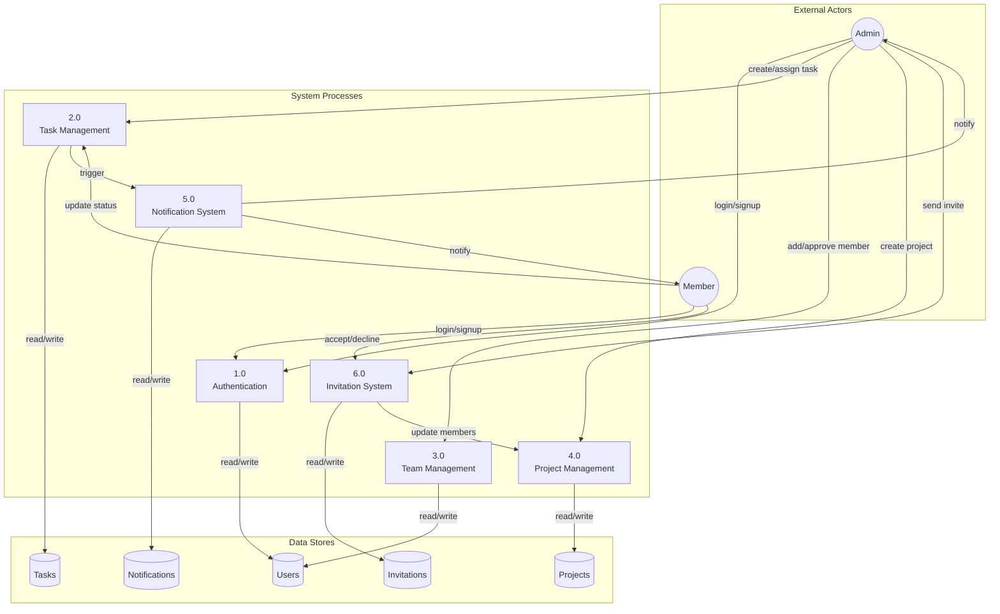
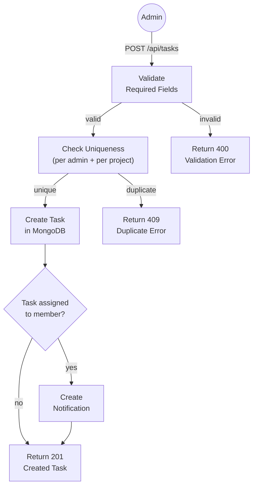

# Data Flow Diagram

## Level 0 — Context Diagram

```mermaid
graph LR
    Admin((Admin User))
    Member((Team Member))
    TF["TaskForge<br/>System"]

    Admin -->|"Create tasks, projects<br/>Manage team"| TF
    TF -->|"Dashboard data<br/>Notifications"| Admin
    Member -->|"Update task status<br/>Accept invitations"| TF
    TF -->|"Assigned tasks<br/>Notifications"| Member
```

## Level 1 — System Processes

```mermaid
graph TB
    subgraph External["External Actors"]
        A((Admin))
        M((Member))
    end

    subgraph Processes["System Processes"]
        P1["1.0<br/>Authentication"]
        P2["2.0<br/>Task Management"]
        P3["3.0<br/>Team Management"]
        P4["4.0<br/>Project Management"]
        P5["5.0<br/>Notification System"]
        P6["6.0<br/>Invitation System"]
    end

    subgraph DataStores["Data Stores"]
        D1[(Users)]
        D2[(Tasks)]
        D3[(Projects)]
        D4[(Notifications)]
        D5[(Invitations)]
    end

    A -->|"login/signup"| P1
    M -->|"login/signup"| P1
    P1 -->|"read/write"| D1

    A -->|"create/assign task"| P2
    M -->|"update status"| P2
    P2 -->|"read/write"| D2
    P2 -->|"trigger"| P5

    A -->|"add/approve member"| P3
    P3 -->|"read/write"| D1

    A -->|"create project"| P4
    P4 -->|"read/write"| D3

    P5 -->|"read/write"| D4
    P5 -->|"notify"| A
    P5 -->|"notify"| M

    A -->|"send invite"| P6
    M -->|"accept/decline"| P6
    P6 -->|"read/write"| D5
    P6 -->|"update members"| P4
```

## Level 2 — Task Creation Detail

```mermaid
graph TB
    A((Admin)) -->|"POST /api/tasks"| V["Validate<br/>Required Fields"]
    V -->|valid| UC["Check Uniqueness<br/>(per admin + per project)"]
    V -->|invalid| E1["Return 400<br/>Validation Error"]

    UC -->|unique| CR["Create Task<br/>in MongoDB"]
    UC -->|duplicate| E2["Return 409<br/>Duplicate Error"]

    CR --> CHK{"Task assigned<br/>to member?"}
    CHK -->|yes| NT["Create<br/>Notification"]
    CHK -->|no| RES["Return 201<br/>Created Task"]
    NT --> RES
```
