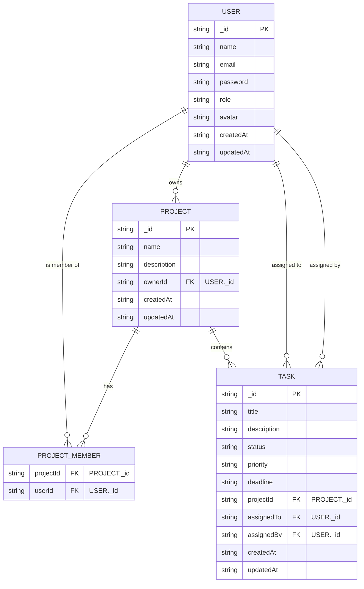

# Entity-Relationship Diagram

```mermaid
erDiagram
    USER {
        string _id PK
        string name
        string email
        string password
        string role
        string avatar
        string createdAt
        string updatedAt
    }

    PROJECT {
        string _id PK
        string name
        string description
        string ownerId FK "USER._id"
        string createdAt
        string updatedAt
    }

    TASK {
        string _id PK
        string title
        string description
        string status
        string priority
        string deadline
        string projectId FK "PROJECT._id"
        string assignedTo FK "USER._id"
        string assignedBy FK "USER._id"
        string createdAt
        string updatedAt
    }

    PROJECT_MEMBER {
        string projectId FK "PROJECT._id"
        string userId FK "USER._id"
    }

    USER ||--o{ PROJECT : "owns"
    USER ||--o{ PROJECT_MEMBER : "is member of"
    PROJECT ||--o{ PROJECT_MEMBER : "has"
    PROJECT ||--o{ TASK : "contains"
    USER ||--o{ TASK : "assigned to"
    USER ||--o{ TASK : "assigned by"
```
