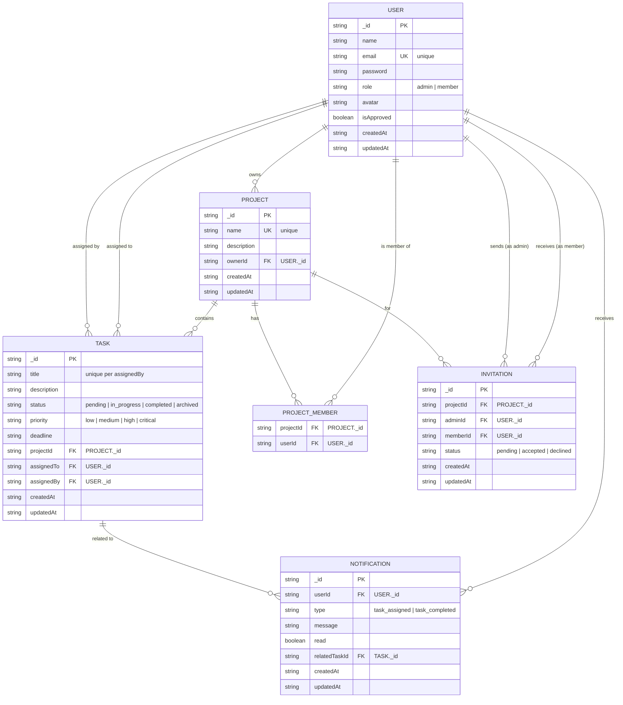

# Entity-Relationship Diagram

```mermaid
erDiagram
    USER {
        string _id PK
        string name
        string email UK "unique"
        string password
        string role "admin | member"
        string avatar
        boolean isApproved
        string createdAt
        string updatedAt
    }

    PROJECT {
        string _id PK
        string name UK "unique"
        string description
        string ownerId FK "USER._id"
        string createdAt
        string updatedAt
    }

    TASK {
        string _id PK
        string title "unique per assignedBy"
        string description
        string status "pending | in_progress | completed | archived"
        string priority "low | medium | high | critical"
        string deadline
        string projectId FK "PROJECT._id"
        string assignedTo FK "USER._id"
        string assignedBy FK "USER._id"
        string createdAt
        string updatedAt
    }

    PROJECT_MEMBER {
        string projectId FK "PROJECT._id"
        string userId FK "USER._id"
    }

    INVITATION {
        string _id PK
        string projectId FK "PROJECT._id"
        string adminId FK "USER._id"
        string memberId FK "USER._id"
        string status "pending | accepted | declined"
        string createdAt
        string updatedAt
    }

    NOTIFICATION {
        string _id PK
        string userId FK "USER._id"
        string type "task_assigned | task_completed"
        string message
        boolean read
        string relatedTaskId FK "TASK._id"
        string createdAt
        string updatedAt
    }

    USER ||--o{ PROJECT : "owns"
    USER ||--o{ PROJECT_MEMBER : "is member of"
    PROJECT ||--o{ PROJECT_MEMBER : "has"
    PROJECT ||--o{ TASK : "contains"
    USER ||--o{ TASK : "assigned to"
    USER ||--o{ TASK : "assigned by"
    USER ||--o{ INVITATION : "receives (as member)"
    USER ||--o{ INVITATION : "sends (as admin)"
    PROJECT ||--o{ INVITATION : "for"
    USER ||--o{ NOTIFICATION : "receives"
    TASK ||--o{ NOTIFICATION : "related to"
```
