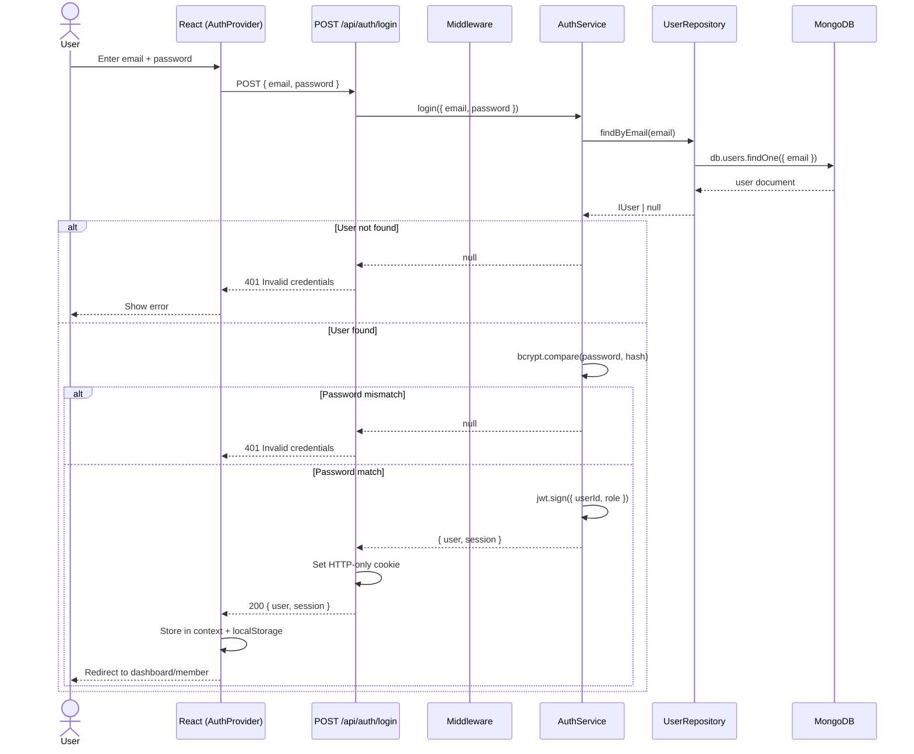
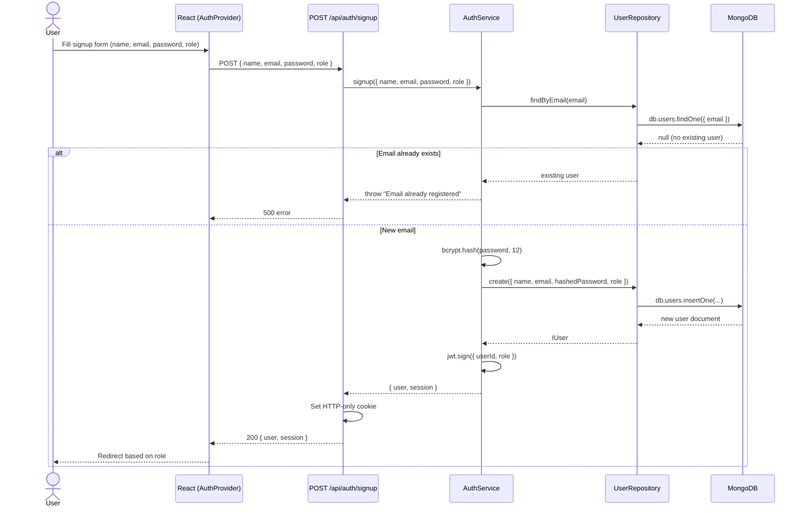
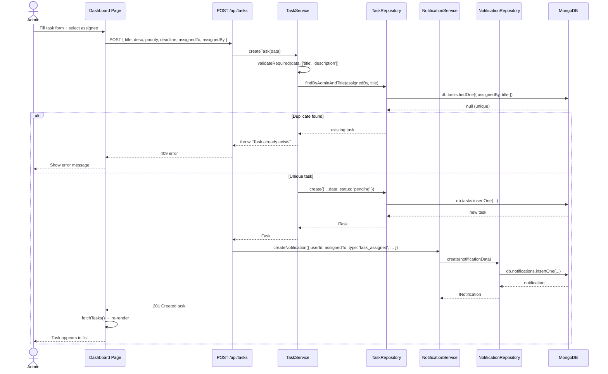
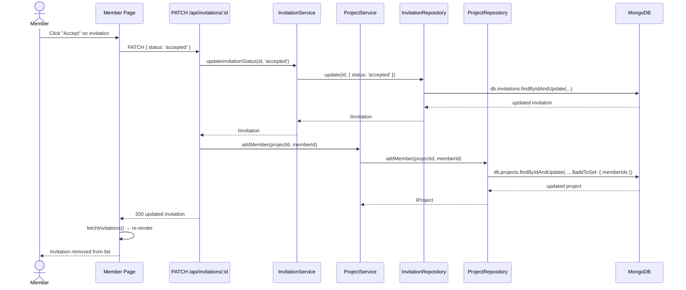

# Sequence Diagrams

## 1. User Login Flow

```mermaid
sequenceDiagram
    actor User
    participant Browser as React (AuthProvider)
    participant API as POST /api/auth/login
    participant MW as Middleware
    participant AS as AuthService
    participant UR as UserRepository
    participant DB as MongoDB

    User->>Browser: Enter email + password
    Browser->>API: POST { email, password }

    API->>AS: login({ email, password })
    AS->>UR: findByEmail(email)
    UR->>DB: db.users.findOne({ email })
    DB-->>UR: user document
    UR-->>AS: IUser | null

    alt User not found
        AS-->>API: null
        API-->>Browser: 401 Invalid credentials
        Browser-->>User: Show error
    else User found
        AS->>AS: bcrypt.compare(password, hash)
        alt Password mismatch
            AS-->>API: null
            API-->>Browser: 401 Invalid credentials
        else Password match
            AS->>AS: jwt.sign({ userId, role })
            AS-->>API: { user, session }
            API->>API: Set HTTP-only cookie
            API-->>Browser: 200 { user, session }
            Browser->>Browser: Store in context + localStorage
            Browser-->>User: Redirect to dashboard/member
        end
    end
```

## 2. User Signup Flow

```mermaid
sequenceDiagram
    actor User
    participant Browser as React (AuthProvider)
    participant API as POST /api/auth/signup
    participant AS as AuthService
    participant UR as UserRepository
    participant DB as MongoDB

    User->>Browser: Fill signup form (name, email, password, role)
    Browser->>API: POST { name, email, password, role }

    API->>AS: signup({ name, email, password, role })
    AS->>UR: findByEmail(email)
    UR->>DB: db.users.findOne({ email })
    DB-->>UR: null (no existing user)

    alt Email already exists
        UR-->>AS: existing user
        AS-->>API: throw "Email already registered"
        API-->>Browser: 500 error
    else New email
        AS->>AS: bcrypt.hash(password, 12)
        AS->>UR: create({ name, email, hashedPassword, role })
        UR->>DB: db.users.insertOne(...)
        DB-->>UR: new user document
        UR-->>AS: IUser

        AS->>AS: jwt.sign({ userId, role })
        AS-->>API: { user, session }
        API->>API: Set HTTP-only cookie
        API-->>Browser: 200 { user, session }
        Browser-->>User: Redirect based on role
    end
```

## 3. Task Creation with Notification

```mermaid
sequenceDiagram
    actor Admin
    participant Dashboard as Dashboard Page
    participant TAPI as POST /api/tasks
    participant TS as TaskService
    participant TR as TaskRepository
    participant NS as NotificationService
    participant NR as NotificationRepository
    participant DB as MongoDB

    Admin->>Dashboard: Fill task form + select assignee
    Dashboard->>TAPI: POST { title, desc, priority, deadline, assignedTo, assignedBy }

    TAPI->>TS: createTask(data)
    TS->>TS: validateRequired(data, ['title', 'description'])

    TS->>TR: findByAdminAndTitle(assignedBy, title)
    TR->>DB: db.tasks.findOne({ assignedBy, title })
    DB-->>TR: null (unique)

    alt Duplicate found
        TR-->>TS: existing task
        TS-->>TAPI: throw "Task already exists"
        TAPI-->>Dashboard: 409 error
        Dashboard-->>Admin: Show error message
    else Unique task
        TS->>TR: create({ ...data, status: 'pending' })
        TR->>DB: db.tasks.insertOne(...)
        DB-->>TR: new task
        TR-->>TS: ITask
        TS-->>TAPI: ITask

        TAPI->>NS: createNotification({ userId: assignedTo, type: 'task_assigned', ... })
        NS->>NR: create(notificationData)
        NR->>DB: db.notifications.insertOne(...)
        DB-->>NR: notification
        NR-->>NS: INotification

        TAPI-->>Dashboard: 201 Created task
        Dashboard->>Dashboard: fetchTasks() → re-render
        Dashboard-->>Admin: Task appears in list
    end
```

## 4. Invitation Accept Flow

```mermaid
sequenceDiagram
    actor Member
    participant MemberPage as Member Page
    participant IAPI as PATCH /api/invitations/:id
    participant IS as InvitationService
    participant PS as ProjectService
    participant IR as InvitationRepository
    participant PR as ProjectRepository
    participant DB as MongoDB

    Member->>MemberPage: Click "Accept" on invitation
    MemberPage->>IAPI: PATCH { status: 'accepted' }

    IAPI->>IS: updateInvitationStatus(id, 'accepted')
    IS->>IR: update(id, { status: 'accepted' })
    IR->>DB: db.invitations.findByIdAndUpdate(...)
    DB-->>IR: updated invitation
    IR-->>IS: IInvitation
    IS-->>IAPI: IInvitation

    IAPI->>PS: addMember(projectId, memberId)
    PS->>PR: addMember(projectId, memberId)
    PR->>DB: db.projects.findByIdAndUpdate(..., $addToSet: { memberIds })
    DB-->>PR: updated project
    PR-->>PS: IProject

    IAPI-->>MemberPage: 200 updated invitation
    MemberPage->>MemberPage: fetchInvitations() → re-render
    MemberPage-->>Member: Invitation removed from list
```
